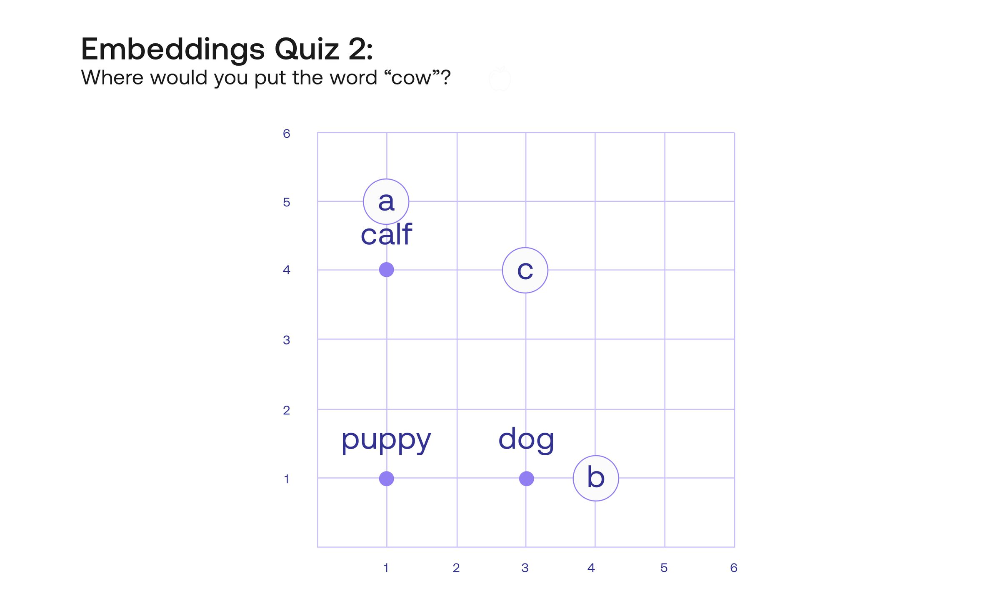
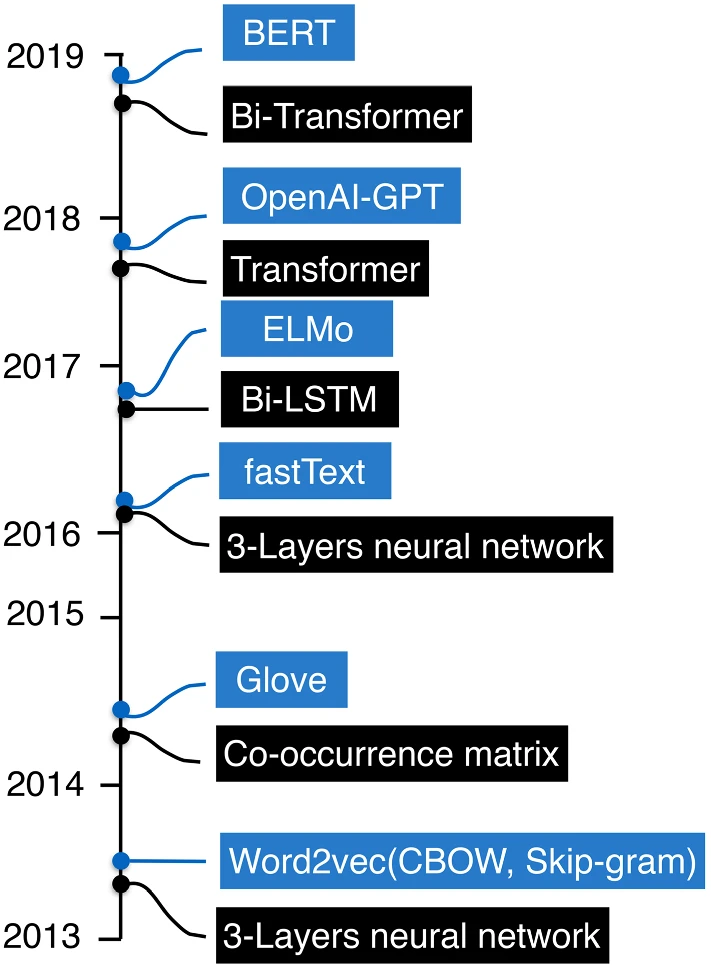
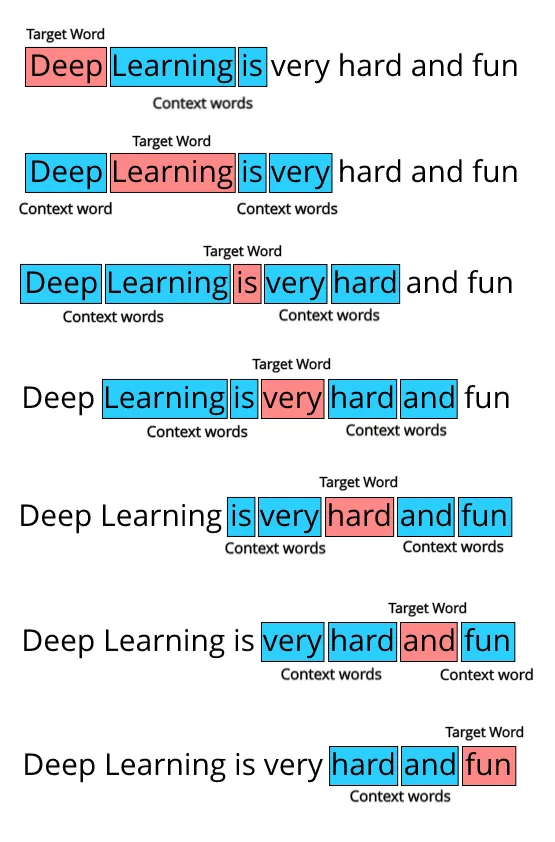
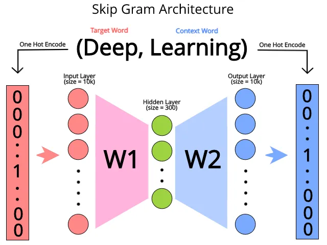
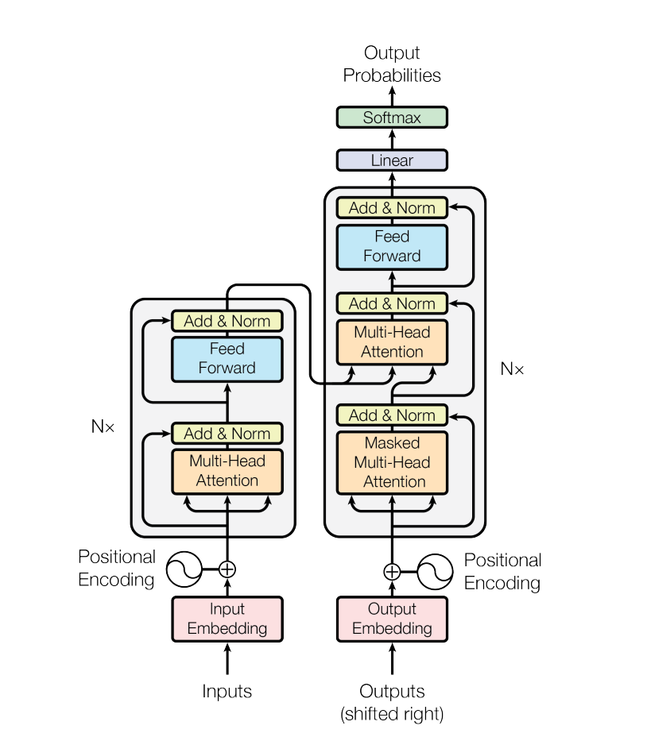
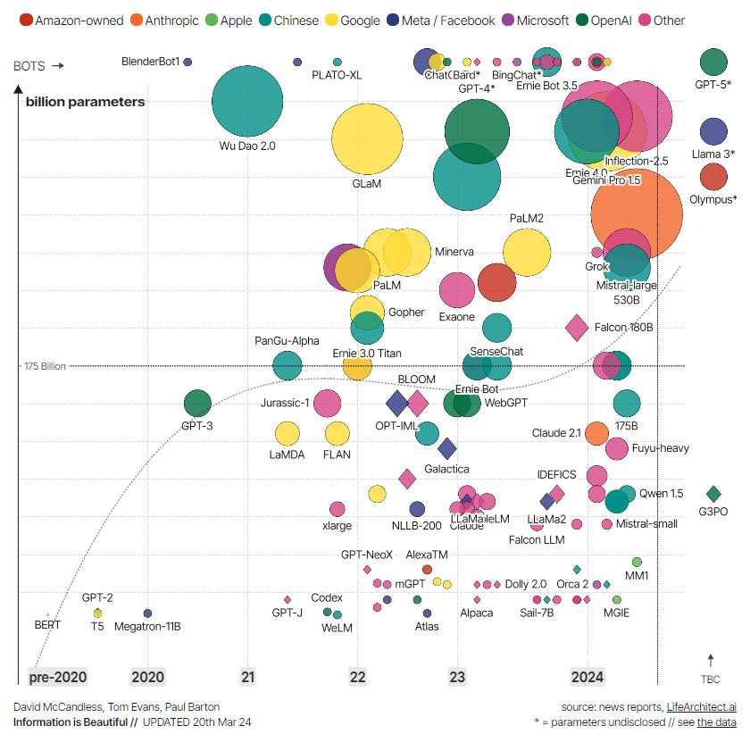

# Text analysis II
## Embeddings and Large Language Models 


# Bag of Words: **Recap**

frequency based method:
* count of words in corpus/per document
* high dimensional sparse document feature matrix
* can be weighted (e.g. TF-IDF)

<!--
- really easy to create and understand
- really simple -> really fast
-->

# Bag of Words: **Drawbacks**

1. sparse matrix: huge dimensions and empty cells
2. no relationships of words through vectorization

<!--
- why is this a problem?
- simple vectorization doesn't reflect meaning of words
- there is no relation, on the vector level, between words with same meaning
- e.g. like & love, not the same words, but transport comparable meaning
-->

# Quiz: **How can we imagine the meaning of words?**

---


<!--
- a or c
- share something in common
- not everything, but on some level words are comparable 
-->

---



<!--
- words receive meaning in comparison to other words
- relations between words are reflected

- there is a reason these examples where in a diagram
- numerical representation of "meaning"
- two-dimensional space, for visual representation
- we as humans learned and know intuitive
- but how can computers learn this relations?
-->


# Word embeddings: **Vectorization of meaning**

* theoretical background: distribution hypothesis
  $\rightarrow$ "a word is characterized by the company it keeps" [Firth 1957](https://www.worldcat.org/de/title/studies-in-linguistic-analysis/oclc/907573426)
* word embeddings represent words as real-valued vectors
* similar word vectors for words in same context 
* lower dimensional space, each dimension corresponds to an aspect of the word’s meaning
&nbsp;
* (mostly) neuronal network
* innovative base for current advancements of large language models

<!--
Question: What different kind of words will be predicted?
- both: words that appear often together
- AND substitutes or similar words:
- not often together, but appear often in the same context
- tea or coffee, not the same, but appear in the same sentence:
If it's raining, I like my hot ... .
- this movie was really good! VS: this movie was really bad!

capture semantic and syntactic relationships between words, 
allowing machines to understand the meaning of words based on their contextual usage.
-->

---

[Test with Online Demo](https://www.cs.cmu.edu/~dst/WordEmbeddingDemo/)


<!--
1. see vectors for different words
2. see words in 3 dimensional space
3. see most similar words
4. calculate with vectors
-->

# Word embeddings: **Development**



Classic word embeddings:
2013 [Word2vec](https://arxiv.org/abs/1301.3781): CBOW, Skip-gram
2014 [GloVe](https://www.researchgate.net/publication/284576917_Glove_Global_Vectors_for_Word_Representation): co-occurrence matrix
2017 [fastText](https://arxiv.org/abs/1607.04606): character n-grams

Language models using word embeddings:
2018 [ELMo](https://arxiv.org/abs/1802.05365): context sensitive
2018 [BERT](https://arxiv.org/abs/1810.04805v2): bi-directional transformer
2018 [GPT](https://cdn.openai.com/research-covers/language-unsupervised/language_understanding_paper.pdf): uni-directional transformer

<!--
Glove
- hybrid: adds global co-occurance statistics to window-based-method)
- faster and also for rare words

FastText
- character n-grams (for morphologically rich languages like german, arabic, and typos)

not all, but most important
-->

# Word2Vec: **Prediction**

**1. create training data**
- sliding context window (size)
- pairs of target and context words

<style scoped>
table {
  font-size: 18px;
  margin-left: 0.7cm;
  margin-top: 0.2cm;
}
</style>

| Target   | Context  |
| -------- | -------- |
| Deep     | Learning |
| Deep     | is       |
| Learning | Deep     |
| Learning | is       |
| Learning | very     |
| Learning | hard     |



<!--
- window size: a window of words which surround target word
- context window is hyperparameter, could differ results: 
- longer window =  tend to capture more topic/domain information: what other words (of any type) are used in related discussions?
- shorter window = tend to capture more about word itself: what other words are functionally similar?
- larger window size longer training time

- training data: pair of target and context words
-->

---



**2. train neuronal network:**
 - three layers: target word $\rightarrow$ hidden layer $\rightarrow$ context word
 - input and output layer = one-hot vectors of vocabulary size (V)
 - hidden layer = size of vector dimension (N)

<!--
- pass each pair into the neural network and train it
- task the neural network is trying to do: guess which context words can appear given a target word.
-->

# Word embeddings: **Limitations**

* different contexts & polysemy
* out-of-vocabulary words
* limited context window
* cultural bias in word relations
* pre-processing, algorithm and hyperparameter can vary results
* coherence of meaning
* large amount of text data for self-training

<!--
- polysemy (multiple meanings of same word) river bank vs. financial bank
- newer: contextualized word embeddings (e.g., BERT, GPT)
- rare, new and domain specific words
- broader context in longer sentences/documents
- combination of words/concepts influenced by stereotypes
- what are valid word embeddings?
- over time, between documents and cultures
-->

# Word embeddings: **Applications**

* search engines & information retrieval
* language translation
* use in ML algorithms (e.g. classifier)
* find biases (in language)
* study cultural differences (also over time)
* create domain specific dictionaries

<!--
- search for “soccer,” the search engine also gives you results for “football” as they’re two different names for the same game
- similar concepts of words in different langues with similar word embeddings
- as we know, computers and ML algorithms need numerical input -> word embeddings store meanings and relations of words -> more information that can be used
- 
-->

# Word embeddings: **Research**


Word embeddings quantify 100 years of gender and ethnic stereotypes. 
Nikhil Garg, Londa Schiebinger, Dan Jurafsky, and James Zou (2018)
[Paper](https://www.pnas.org/doi/10.1073/pnas.1720347115)


# Language Models: **Transformers**



[Paper: Attention is all you need](https://arxiv.org/abs/1706.03762)


# Language Models: **Evolution tree**


[Source: LLMsPracticalGuide](https://github.com/Mooler0410/LLMsPracticalGuide)

<!--
encoder -> transform input text to numeric representation & labels -> classification tasks
decoder -> transform input text to sequence output of text (next token prediction)
-->


# Language Models: **Huge development**



[Interactive Visualization](https://informationisbeautiful.net/visualizations/the-rise-of-generative-ai-large-language-models-llms-like-chatgpt/)


# Language Models: **Concepts**

* sub-word tokens [(try OpenAI tokenizer)](https://platform.openai.com/tokenizer)
* attention mechanism
* contextual embeddings
* self-supervised learning
* masked language model, next word prediction
* pre-training, transfer learning, fine-tuning
* prompt(engineering), in-context learning
* model parameters vs [hyperparameters](https://michaelehab.medium.com/the-secrets-of-large-language-models-parameters-how-they-affect-the-quality-diversity-and-32eb8643e631)


# Language Models: **Access**

Most famous are (commercial) products like Chatbots (e.g. ChatGPT) or specialized tools (e.g. Copilot).
But we as researchers are interested in direct access to different models for comparison and automation for a variety of tasks. 

1. API access from companies providing LLMs
2. Huggingface as platform for open source LLMs
3. Ollama to run open source LLMs locally


# API call: **OpenAI**

[API documentation](https://platform.openai.com/docs/quickstart)

```python
from openai import OpenAI

client = OpenAI(api_key = xxx)

completion = client.chat.completions.create(
  model="gpt-3.5-turbo",
  temperature= "0.2",
  messages=[
    {"role": "system", "content": "You are a poetic assistant, skilled in explaining complex programming concepts with creative flair."},
    {"role": "user", "content": "Compose a poem that explains the concept of recursion in programming."}
  ]
)

print(completion.choices[0].message)
```


# Open source model hub: **Huggingface**


[Huggingface](https://huggingface.co/)

[How to use Pythons Huggingface transformers library in R](https://rpubs.com/eR_ic/transfoRmers)

[Sentence Transformers](https://huggingface.co/models?library=sentence-transformers)


# Open source models locally: **Ollama**


[Language models](https://ollama.com/library)

[Embedding models](https://ollama.com/blog/embedding-models)


# How-to: **R-packages**

| R-Package                                                      | Python | APIs (paid) | Open Source    | Note            |
| -------------------------------------------------------------- | ------ | ----------- | -------------- | --------------- |
| [tidychatmodels](https://github.com/AlbertRapp/tidychatmodels) | No     | OpenAI      | Ollama (local) |                 |
| [rollama](https://jbgruber.github.io/rollama/)                 | No     | No          | Ollama (local) | Also Embeddings |
| [huggingfaceR](https://github.com/farach/huggingfaceR)         | Yes    | No          | Huggingface    |                 |
| [openai](https://irudnyts.github.io/openai/)                   | No     | OpenAI      | No             | Also Embeddings |
| [text](https://github.com/OscarKjell/text)                     | Yes    | No          | Huggingface    | Just Embeddings |


# How-to: **Reticulate**

- R-Package to use Python in R environment (Anaconda needs to be installed)

- for overview of commands see the [cheatsheet](https://rstudio.github.io/cheatsheets/reticulate.pdf)

- use python with R in different ways:
  1. reticulate commands and syntax
  2. save (some) functions in .py file and run them from R
  3. use quarto files with python chunks

- in R use \$ instead of . to combine functions


# Similarity: **Sentence embeddings from OpenAI**

```r
openai <- import("openai")

client <- openai$OpenAI(<APIKEY>)

get_embeddings <- function(text, model = "text-embedding-3-small") {
  client$embeddings$create(input = text, model = model)$data[[1]]$embedding
}

embedd_ls <- lapply(<TEXT>, get_embeddings)

embedd <- do.call(rbind, embedd_ls)

lsa::cosine(embedd)
```


# Sentiment Analysis: **BERT Classifier**

Using huggingface and transformers library ([How to](https://huggingface.co/blog/sentiment-analysis-python#2-how-to-use-pre-trained-sentiment-analysis-models-with-python))

```python
from transformers import pipeline

sentiment_pipeline = pipeline("sentiment-analysis", <MODEL>) # model optional

data = ["I love you", "I hate you"]

sentiment_pipeline(data)
```


# Sentiment Analysis: **OpenAI LLM with R-Package**

```r
library(tidychatmodels)

chat_model <- create_chat(<VENDOR>, <APIKEY>) |>
  add_model(<MODEL>)

chat <- chat_model |>
  add_params(<PARAMS>) |>
  add_message(<MESSAGE>) |> # can be repeated
  perform_chat() |>
  extract_chat()
```


# Exercise

**Important**: 
- carefully read tasks
- tryout different workflows (packages, R, Python)
- choose appropriate models (BERT, GPT, Embeddings)
- if you want to use provided OpenAI API key: 
  - 1\. part in file + 2. part: **DahpUIy8A**
  - don't write in script
  - use delay in loops `Sys.sleep(2)`
- play around and have fun !!