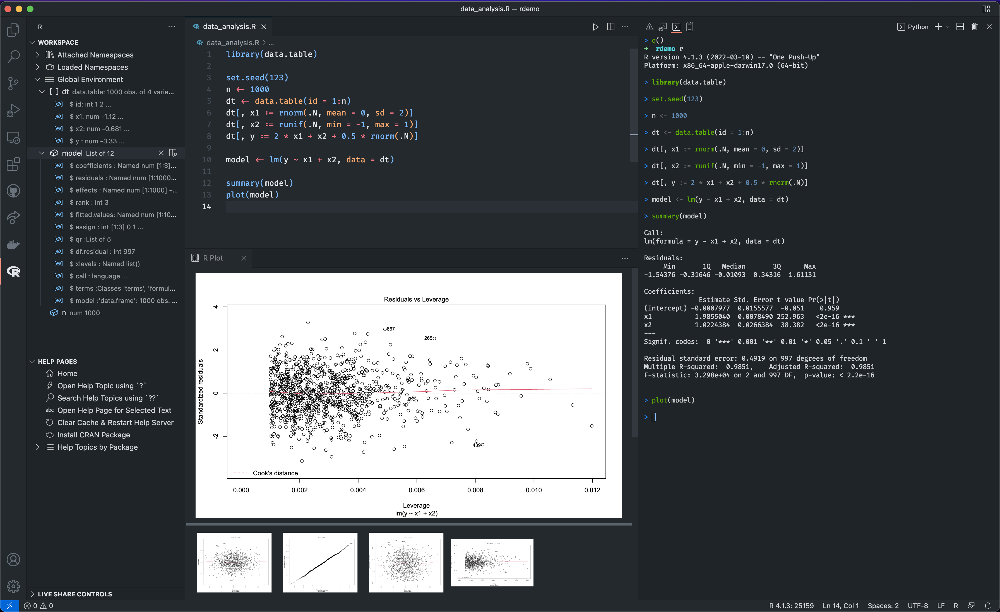

# Necessary and useful packages and software

# Installion: **RSelenium**

Install RSelenium: [Video](https://www.youtube.com/watch?v=GnpJujF9dBw)

```r
install.packages(c("RSelenium", "wdman", "netstat", "binman"))

library(RSelenium)
library(wdman)

selenium()

selenium_object <- selenium(retcommand = TRUE,
                            check = FALSE)
```

---

- start the remote driver
- This deviates from the video, because the RSelenium chrome drivers are not up 
- to date. You will have to install whatever your version is from here: 
- https://googlechromelabs.github.io/chrome-for-testing/
- See this video for a step by step: https://www.youtube.com/watch?v=BnY4PZyL9cg

```r
binman::list_versions("chromedriver")

remote_driver <- rsDriver(browser = "chrome",
                          chromever = "126.0.6478.127",
                          verbose = FALSE,
                          port = free_port())

# close the server
remote_driver$server$stop()

# If you start it a few times, but never close the server there might be no empty port left.
# You can run the following to kill all java processes
system("taskkill /im java.exe /f", intern=FALSE, ignore.stdout=FALSE)
```

# Installion: **Python Anaconda**

- Anaconda is a free and open-source distribution of the Python programming language
- includes also Jupyter Notebooks, Conda (Package Manager) and over 1500 pre-installed data science related packages
- will be useful to interact with LLM models with Python (from RStudio)
Decide which one to download:
- [Anaconda](https://www.anaconda.com/download/success) (extensive and effortless)
- [Miniconda](https://docs.anaconda.com/free/miniconda/) (slim and customizable)


# Code Editor: **VSCode**




# Code Editor: **Benefits**

- Swiss army knife for coding and file management
  - search (and replace) in whole project folder
  - side-by-side editor windows
  - better file and folder management
  - customizable (with extensions)
- multiple languages supported (e.g. R, Python, Notebooks, LaTeX, Markdown)
- easy Git(Hub) integration for better workflow
- with R:
  - run multiple R Sessions in parallel
  - scripts still editable if process is busy


# Code Editor: **Resources**

- https://code.visualstudio.com/docs/languages/r
- https://renkun.me/2019/12/11/writing-r-in-vscode-a-fresh-start/
- https://schiff.co.nz/blog/r-and-vscode/
- https://rolkra.github.io/R-VSCode/
