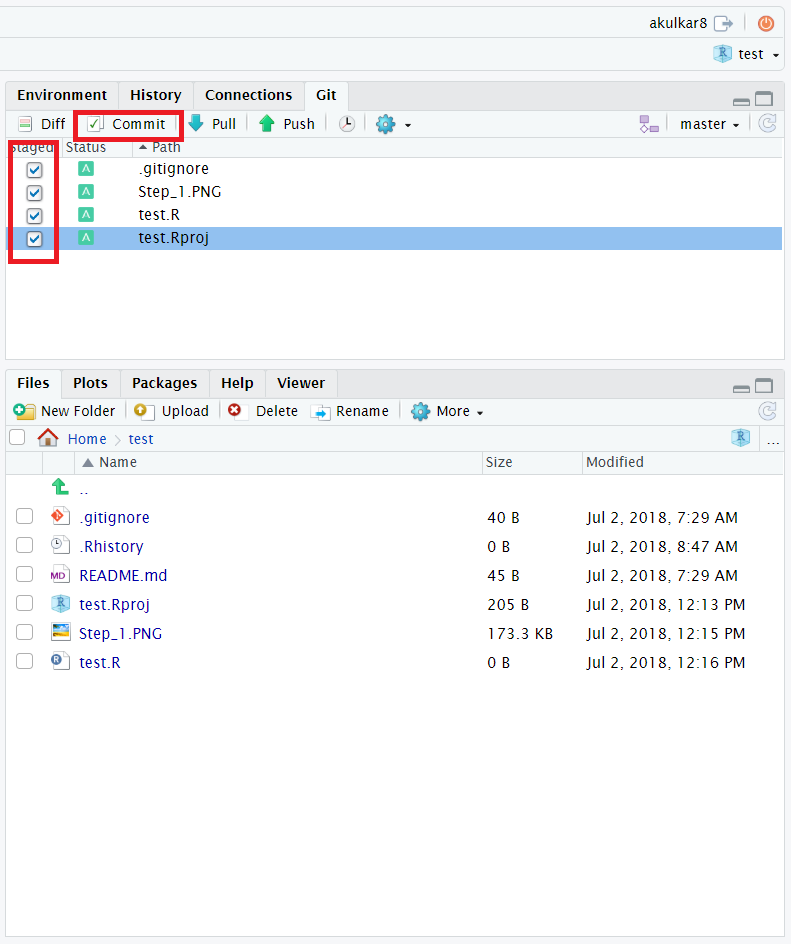
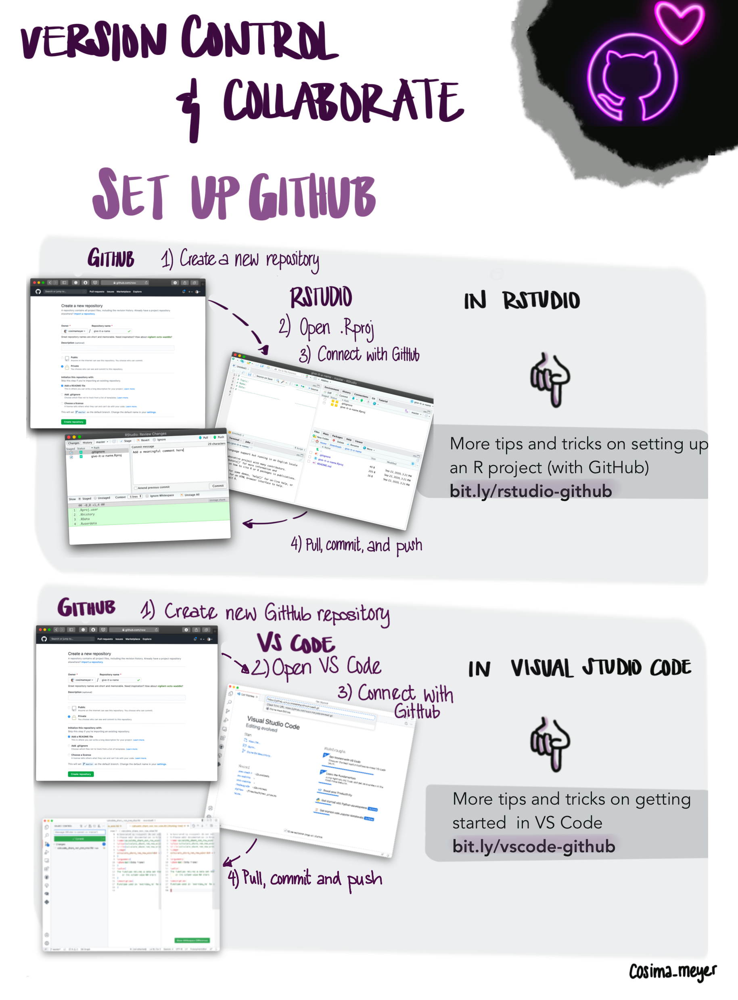
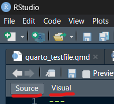

# Introduction to useful software and workflows

<!--
- first day: go one with more formal and technical stuff
- share some over all experience and recommendations for good workflow
- working with data and code, reports and presentations
1. folder and file structure
2. small advertisement for using a code editor 
3. using git and github, getting course material and work together
-->

# Git: **Idea and concept**


- distributed version control system
- track and document changes in code
- compare and find differences
- "time travel maschine"
- helps to imagine changes as smaller tasks
- collaborate on projects, share and publish them

<!--
- started 2005 by Linus Torvald
  
- mostly used by software developers
- more and more in academia: open data -> open code
  
- steep learning curve
- recommend to test this two weeks and see how it goes and if useful
-->

# Git: **How to use it**

|                                                         | Ease of use                           | Efficiency                          | Nerdiness                             |
| ------------------------------------------------------- | ------------------------------------- | ----------------------------------- | ------------------------------------- |
| CLI                                                     | $\bullet\circ\circ\circ\circ$         | $\bullet\bullet\circ\circ\circ$     | $\bullet\bullet\bullet\bullet\bullet$ |
| [GUI](https://de.wikipedia.org/wiki/Liste_von_Git-GUIs) | $\bullet\bullet\bullet\circ\circ$     | $\bullet\bullet\bullet\circ\circ$   | $\bullet\bullet\circ\circ\circ$       |
| RStudio                                                 | $\bullet\bullet\bullet\circ\circ$     | $\bullet\bullet\bullet\bullet\circ$ | $\bullet\bullet\bullet\circ\circ$     |
| VSCode                                                  | $\bullet\bullet\bullet\bullet\bullet$ | $\bullet\bullet\bullet\bullet\circ$ | $\bullet\bullet\bullet\bullet\circ$   |

<!--
- small table compares different variants to use git
- first place a simple tool used from the command line
  
- following I will show commands: helps to see the workflow and learn keywords and concepts
- using GUI or CE does the same but much more user friendly
-->

---


<!--
- small graph with the basics command and workflow
- important: local and remote
- commands always start with git
- then command what you want to do
- mostly followed by arguments and options

- I present commands -> concepts are the same in a GUI, named identical
-->

# Git: **First and basic steps**

```
$ git config --global user.name <your name>
$ git init <your repository name>
$ git status

$ git add <file-name-1> <file-name-2> OR --all
$ git commit -m “<commit-message>”
OR BOTH IN ONE
$ git commit -am “<commit-message>”
```

<!--
- git config: first step after installation
- sets the author name (and email) address respectively to be used with your commits
- git init is used to start a new repository
- git status gives us all the necessary information about the current branch
  whether the current branch is up to date
  Whether there is anything to commit, push or pull
  Whether there are files staged, unstaged or untracked
  Whether there are files created, modified or deleted
- git add adds file(s) or all to the staging area
- git commit records or snapshots the file permanently in the version history
-->

# GitHub: **Remote and cooperative workflow**

```
$ git clone <git-repo-url>

$ git branch < branch-name>
$ git checkout <name-of-your-branch>
OR BOTH IN ONE
$ git checkout -b <name-of-your-branch>

$ git push

& git fetch
& git merge <branch-name>
OR BOTH IN ONE
$ git pull <remote> (<branch-name>)

$ git fork 
```

<!--
- git clone makes an identical copy of the latest version of a project in a repository and saves it to your computer
By using branches, several developers are able to work in parallel on the same project simultaneously
- git branch creates a new branch
- use git checkout mostly for switching from one branch to another
- git push sends the committed changes of master branch to your remote repository
- git fetch update your local dev branch:
- git merge merges your new branch with the parent/main branch.
- git pull fetches and merges changes on the remote server to your working directory
- git fork creates a linked copie from other people's repositories.
-->

# GitHub: **Credentials**

- for GitHub remote commands: Account and personal access token needed
- Settings $\rightarrow$ Developer Setting $\rightarrow$ Personal Access Tokens $\rightarrow$ Generate new token
- on local machine enter username and PAT every time, or store:
  1. in CLI: `git config credential.helper store`
  2. in RStudio: `credentials::set_github_pat("YourPAT")`


# GitHub: **.gitignore**

**How it works:** text file with folder names and files (patterns) not to track

**Use case:** sensitive data; temp and old files; big data files; outputs
  $\rightarrow$ usually track just plain text files (e.g. R scripts, TeX source, etc.) 

**Get startet:** 2 approaches ([online tool creates .gitignore content for you](https://www.toptal.com/developers/gitignore))

```
/data/old
passworts.txt
*.doc
------OR------
/*
!.gitignore
!/scripts
```

# Git: **In RStudio**


1. you need to start a new project in RStudio (clone from repository):
File $\rightarrow$ New Project $\rightarrow$ Version Control $\rightarrow$ Git $\rightarrow$ Add URL and Folder
2. new in upper right corner of the screen: **Git**
3. add, commit and push your changes directly in RStudio to GitHub

# Git: **Resources**

- [Intro to Git, for the Social Scientist](https://www.nimirea.com/blog/2019/05/10/git-for-social-scientists/)
- [Git for Social Scientists](https://jortdevreeze.com/en/blog/how-git-can-make-you-a-more-effective-social-scientist/)
- [Git for Students in the Social Sciences](https://www.shirokuriwaki.com/programming/kuriwaki_github_handout.pdf)
- [GitHub - The Perks of Collaboration](https://cosimameyer.com/post/git-the-perks-of-collaboration-and-version-control/)
- [AI tool suggesting git command](https://www.gitfluence.com/)
- [Configure GitHub for Rstudio](https://gist.github.com/Z3tt/3dab3535007acf108391649766409421)


# Exercise: **Course material**



0. find in groups
1. install git & create a GitHub account
2. become collaborator (tell me your username)
3. clone our course material [**repository**](https://www.github.com/StefanMunnes/SICSS_Berlin_2024)
4. add a personal folder and test file in exercises
5. push this changes to the remote repository
6. pull changes of the other participants


# Installation: **Quarto**

On Tuesday and Wednesday, we are going to use Quarto Markdown Documents, instead of R scripts. Quarto should be pre-installed in RStudio. Please check whether it is by opening the file "day1_r_git/quarto_testfile.qmd" with RStudio. 

Also make sure that you see the "Source" and "Visual" buttons in the top left (see image).



If it is not installed, please update your RStudio version!


# Installation: **RSelenium**

You will need to follow the steps described in this [Video](https://www.youtube.com/watch?v=GnpJujF9dBw).

For Everyone:

- Chromedrivers from RSelenium are outdated, download an up to date chromedriver yourself. Check the version of your Chrome browser, and then download the matching chromedriver from [here](https://googlechromelabs.github.io/chrome-for-testing/). See this [video](https://www.youtube.com/watch?v=BnY4PZyL9cg) for a step-by-step guide. 

For Apple users: 

- When selecting the "Architecture" for the Java SDK on [Azul](https://www.azul.com/downloads/), you need to know which version to choose. You find that out by pressing the Apple button and selecting "About this Mac". With M1 or M2, select "Arm 64 bit", or with Intel, select "x86 64 bit". To find the libray: Finder $\rightarrow$ Go to (top of screen) $\rightarrow$ Option $\rightarrow$ Library

---

```r
install.packages(c("RSelenium", "wdman", "netstat", "binman"))

library(RSelenium)
library(wdman)

selenium()

selenium_object <- selenium(retcommand = TRUE,
                            check = FALSE)
```
---

```r
binman::list_versions("chromedriver")

# The following command should open a browser window (you might need to adjust the version!)
remote_driver <- rsDriver(browser = "chrome",
                          chromever = "126.0.6478.127",
                          verbose = FALSE,
                          port = free_port())

                       
# close the server
remote_driver$server$stop()

# If you start it a few times, but never close the server there might be no empty port left.
# You can run the following to kill all java processes
system("taskkill /im java.exe /f", intern=FALSE, ignore.stdout=FALSE)
```

If you manage to start your chrome browser with the above script, RSelenium is installed properly.


# Installion: **Python Anaconda**

- Anaconda is a free and open-source distribution of the Python programming language
- includes also Jupyter Notebooks, Conda (Package Manager) and over 1500 pre-installed data science related packages
- will be useful to interact with LLM models with Python (from RStudio)

Decide which one to download:
- [Anaconda](https://www.anaconda.com/download/success) (extensive and effortless)
- [Miniconda](https://docs.anaconda.com/free/miniconda/) (slim and customizable)


# Code Editor: **VSCode**


# Code Editor: **Benefits**

- Swiss army knife for coding and file management
  - search (and replace) in whole project folder
  - side-by-side editor windows
  - better file and folder management
  - customizable (with extensions)
- multiple languages supported (e.g. R, Python, Notebooks, LaTeX, Markdown)
- easy Git(Hub) integration for better workflow
- with R:
  - run multiple R Sessions in parallel
  - scripts still editable if process is busy


# Code Editor: **Resources**

- https://code.visualstudio.com/docs/languages/r
- https://renkun.me/2019/12/11/writing-r-in-vscode-a-fresh-start/
- https://schiff.co.nz/blog/r-and-vscode/
- https://rolkra.github.io/R-VSCode/


# Best practice: **Folder and file structure**

1. use separate folders for scripts, data, output, and reports
2. if to many files (~10), use subfolders
3. separate raw data files from processed data
4. use clear and consistent names for script, data, and output files:
	- numbering, lowercase, connect words with underscores or hyphens
	- if date is necessary, put at the end, sort by YYYYMMDD
5. multiple script files for different (sub) tasks (max 100 lines)

<!--
- different styles and also personnel preferences
- just some recommendations from our own work experience
- become really handy when collaborating with other's
- in the end: needs to work for you, and your collaborates
- use pre- and suffixes
-->

# Best practice: **Efficient R scripts**

1) define libraries, default variables, source code at top of script
2) comment and structure sections (# ---- headline ----)
3) use pipe operator |> (magritter: %>%) for combining functions
4) use indentations and spaces for readability
5) max line length of 80 characters
6) [DRY](https://en.wikipedia.org/wiki/Don%27t_repeat_yourself) - use lists, lapply, vectorization, and functions
7) use relative paths for data and output
8)  avoid hard coded subsetting and indexing


# Best practice: **Resources**

- [Best Coding Practices for R](https://bookdown.org/content/d1e53ac9-28ce-472f-bc2c-f499f18264a3/folder.html)
- [Structuring R projects](https://www.r-bloggers.com/2018/08/structuring-r-projects/)
- [R Best Practices](https://kdestasio.github.io/post/r_best_practices/)
- [Tips for organising your R code](https://www.r-bloggers.com/2023/01/tips-for-organising-your-r-code/)
- [Nice R Code](https://nicercode.github.io/)
- [Repeating things: looping and the apply family](https://nicercode.github.io/guides/repeating-things/)
