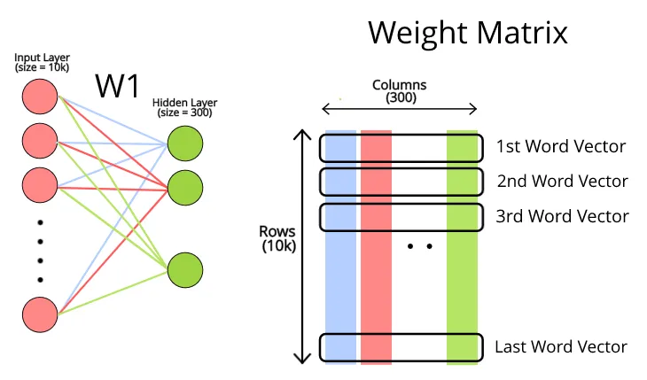
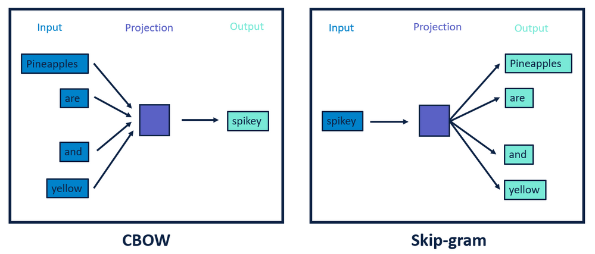
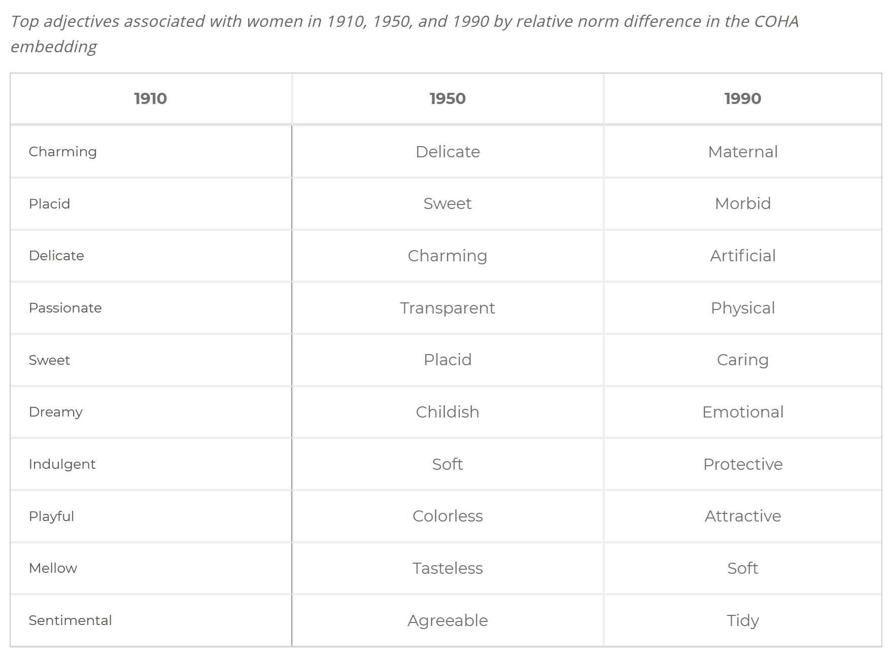

# Text analysis II
## Prediction based methods  


# Bag of Words: **Recap**

frequency based method:
* count of words in corpus/per document
* high dimensional sparse document feature matrix
* can be weighted (e.g. TF-IDF)

<!--
- really easy to create and understand
- really simple -> really fast
-->

# Bag of Words: **Drawbacks**

1. sparse matrix: huge dimensions and empty cells
2. no relationships of words through vectorization

<!--
- why is this a problem?
- simple vectorization doesn't reflect meaning of words
- there is no relation, on the vector level, between words with same meaning
- e.g. like & love, not the same words, but transport comparable meaning
-->

# Quiz: **How can we imagine the meaning of words?**

---


<!--
- a or c
- share something in common
- not everything, but on some level words are comparable 
-->

---


<!--
- words receive meaning in comparison to other words
- relations between words are reflected

- there is a reason these examples where in a diagram
- numerical representation of "meaning"
- two-dimensional space, for visual representation
- we as humans learned and know intuitive
- but how can computers learn this relations?
-->


# Word embeddings: **Vectorization of meaning**

* theoretical background: distribution hypothesis
  $\rightarrow$ "a word is characterized by the company it keeps" [Firth 1957](https://www.worldcat.org/de/title/studies-in-linguistic-analysis/oclc/907573426)
* word embeddings represent words as real-valued vectors
* similar word vectors for words in same context 
* lower dimensional space, each embedding corresponds to an aspect of the word’s meaning
&nbsp;
* (mostly) neuronal network
* innovative base for current advancements of large language models

<!--
Question: What different kind of words will be predicted?
- both: words that appear often together
- AND substitutes or similar words:
- not often together, but appear often in the same context
- tea or coffee, not the same, but appear in the same sentence:
If it's raining, I like my hot ... .
- this movie was really good! VS: this movie was really bad!

capture semantic and syntactic relationships between words, 
allowing machines to understand the meaning of words based on their contextual usage.
-->

---

[Test with Online Demo](https://www.cs.cmu.edu/~dst/WordEmbeddingDemo/)


<!--
1. see vectors for different words
2. see words in 3 dimensional space
3. see most similar words
4. calculate with vectors
-->

# Word embeddings: **Development**


Classic word embeddings:
2013 [Word2vec](https://arxiv.org/abs/1301.3781): CBOW, Skip-gram
2014 [GloVe](https://www.researchgate.net/publication/284576917_Glove_Global_Vectors_for_Word_Representation): co-occurrence matrix
2017 [fastText](https://arxiv.org/abs/1607.04606): character n-grams

Language models using word embeddings:
2018 [ELMo](https://arxiv.org/abs/1802.05365): context sensitive
2018 [BERT](https://arxiv.org/abs/1810.04805v2): bi-directional transformer
2018 [GPT](https://cdn.openai.com/research-covers/language-unsupervised/language_understanding_paper.pdf): uni-directional transformer

<!--
Glove
- hybrid: adds global co-occurance statistics to window-based-method)
- faster and also for rare words

FastText
- character n-grams (for morphologically rich languages like german, arabic, and typos)

not all, but most important
-->

# Word2Vec: **Prediction**

**1. create training data**
- sliding context window (size)
- pairs of target and context words

<style scoped>
table {
  font-size: 18px;
  margin-left: 0.7cm;
  margin-top: 0.2cm;
}
</style>

| Target   | Context  |
| -------- | -------- |
| Deep     | Learning |
| Deep     | is       |
| Learning | Deep     |
| Learning | is       |
| Learning | very     |
| Learning | hard     |


<!--
- window size: a window of words which surround target word
- context window is hyperparameter, could differ results: 
- longer window =  tend to capture more topic/domain information: what other words (of any type) are used in related discussions?
- shorter window = tend to capture more about word itself: what other words are functionally similar?
- larger window size longer training time

- training data: pair of target and context words
-->

---


**2. train neuronal network:**
 - three layers: target word $\rightarrow$ hidden layer $\rightarrow$ context word
 - input and output layer = one-hot vectors of vocabulary size (V)
 - hidden layer = size of vector dimension (N)

<!--
- pass each pair into the neural network and train it
- task the neural network is trying to do: guess which context words can appear given a target word.
-->

---

**3. extract word embeddings**
- word embeddings represent the weights in a matrix
- each row, one-hot encoded vector of a specific word
- columns are weights for each word of vocabulary 


[Source of Figures](https://medium.com/deep-learning-demystified/deep-nlp-word-vectors-with-word2vec-d62cb29b40b3)



<!--
- what a neural network learns is represented in the weights
- we get a matrix with 10k rows and 300 columns, VxN
-->

# Word2vec: **CBOW & Skip-gram**



1. Continuous Bag of Words predicts target word from context words
   - less computationally expensive
2. Skip-gram predicts context words given target word
   - for large corpora and high number of dimensions -> highest accuracy


# Word2vec: **How to use**

1. pre-trained models
- choose own and check data and hyperparameter background

2. train on own corpus
- pre-process (remove high- and low-frequency words)
- choose algorithm (Skip-gram or CBOW)
- choose hyperparameter:
  - dimensions: 100 - 1000 (original: 300)
  - context window: 10 for skip-gram, 5 for CBOW
- (evaluate with benchmarks)

<!--
Larger windows tend to capture more topic/domain information: what other words (of any type) are used in related discussions? 
Smaller windows tend to capture more about word itself: what other words are functionally similar?
-->


# Word2vec: **Implementation in R**

```r
library(word2vec)

model <- word2vec(text_vector, type = "cbow", window = 5, dim = 50)

embeddings <- as.matrix(model)

predict(model, c("criminal", "violent"), type = "nearest", top_n = 5)

wv <- embeddings["white", ] - embeddings["person", ] + embeddings["racism", ] 
predict(model, newdata = wv, type = "nearest", top_n = 10)

write.word2vec(model, "mymodel.bin")
model <- read.word2vec("mymodel.bin")
```

# Word embeddings: **Limitations**

* different contexts & polysemy
* out-of-vocabulary words
* limited context window
* cultural bias in word relations
* pre-processing, algorithm and hyperparameter can vary results
* coherence of meaning
* large amount of text data for self-training

<!--
- polysemy (multiple meanings of same word) river bank vs. financial bank
- newer: contextualized word embeddings (e.g., BERT, GPT)
- rare, new and domain specific words
- broader context in longer sentences/documents
- combination of words/concepts influenced by stereotypes
- what are valid word embeddings?
- over time, between documents and cultures
-->

# Word embeddings: **Applications**

* search engines & information retrieval
* language translation
* use in ML algorithms (e.g. classifier)
* find biases (in language)
* study cultural differences (also over time)
* create domain specific dictionaries

<!--
- search for “soccer,” the search engine also gives you results for “football” as they’re two different names for the same game
- similar concepts of words in different langues with similar word embeddings
- as we know, computers and ML algorithms need numerical input -> word embeddings store meanings and relations of words -> more information that can be used
- 
-->

# Word embeddings: **Research**



Word embeddings quantify 100 years of gender and ethnic stereotypes. 
Nikhil Garg, Londa Schiebinger, Dan Jurafsky, and James Zou (2018)
[Article](https://www.pnas.org/doi/10.1073/pnas.1720347115)


# Exercises

1. train your own word embeddings on the whole news article corpus
   - pre-process data, choose architecture and hyperparameter
   - additional: train separate by newspaper

2. download pre-trained word embeddings (check parameter)
3. compare the most similar words for some important keywords
4. discuss possible differences: method or content? 
